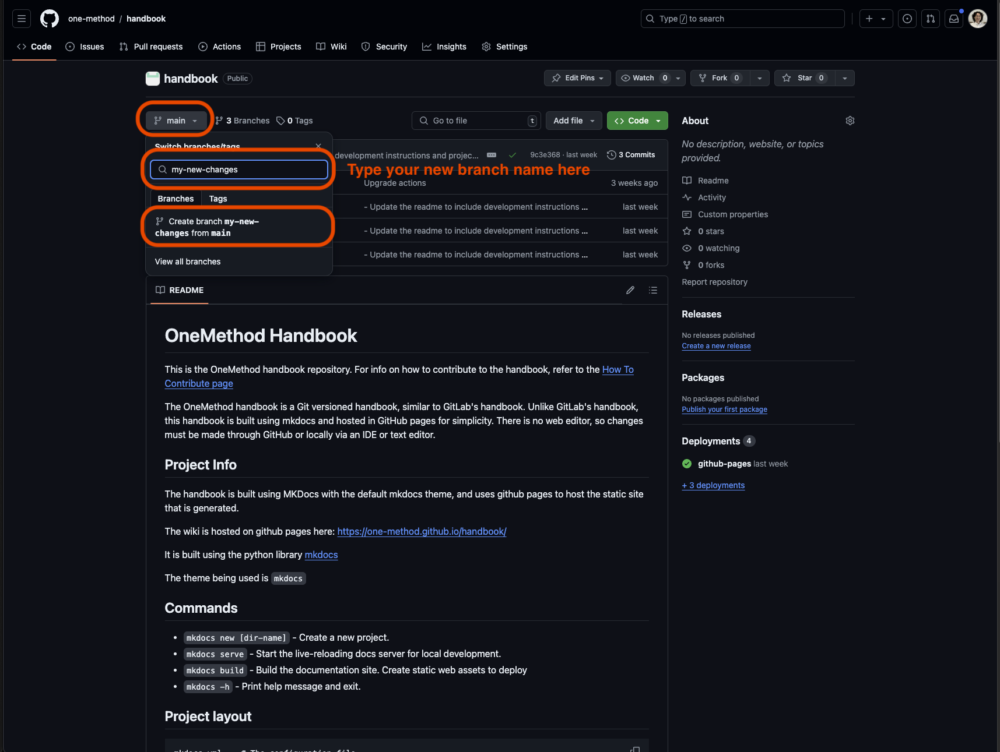

# How to Contribute

This article will walk you through how to contribute to the OneMethod handbook. It will show you how to create new content, and make changes to existing content.

## Pre-requisite Knowledge

### What is Markdown?
This handbook is written in a language called "Markdown". Markdown is a simple way to format text using plain text. It allows you to add elements like headers, bold or italic text, lists, links, and images using easy-to-remember symbols. 

Refer to the [Markdown basic syntax](https://www.markdownguide.org/basic-syntax/) for more information 

### What is GitHub?
GitHub is an online platform for storing, sharing, and collaborating on code projects. We are using it for our handbook to:

1. Store the handbook files.
2. Allow anyone in our organization to add to or edit the handbook.
3. Enable collaboration through features such as branching and pull requests.
4. Publicly share the handbook to outside viewers.
5. Host the handbook on a website using *GitHub Pages*.

To contribute to the handbook you will need a GitHub account, and edit access to the handbook repository (where the files are stored).

### What is MkDocs?
MkDocs is a library that takes a folder structure with markdown files, and creates a wiki out of it. We are using it to genereate the handbook website. 

## Creating your First Contribution
To start contributing to the handbook follow these steps.

### 1. Create a new branch to store your changes in from the main branch.
Create a new branch off of the main branch. This branch will store all your changes without affecting the main branch.

For more detailed instructions on how to write content, refer to the [mkdocs documentation](https://www.mkdocs.org/user-guide/writing-your-docs/)
